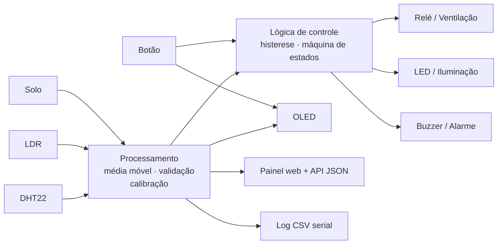

# 🌡️ Estação de Monitoramento Ambiental com ESP32


Sistema embarcado com **ESP32** que lê sensores de temperatura, umidade, luminosidade e umidade do solo, **processa os dados** (filtragem, validação e conversão) e aplica uma **lógica de controle automática** sobre ventilação, iluminação e alarme. As informações aparecem em um display OLED, em um painel web acessível pela rede local e em log CSV pela porta serial.

> Projeto pessoal — 2026 · C/C++ · PlatformIO · simulável no Wokwi

---

## ✨ Funcionalidades

- **Leitura de 4 grandezas**: temperatura e umidade (DHT22), luminosidade (LDR) e umidade do solo (sensor capacitivo).
- **Processamento de sinais**: média móvel em buffer circular, validação de faixa das leituras do DHT22, conversão ADC → porcentagem com calibração de dois pontos e cálculo da sensação térmica.
- **Controle com histerese**: ventilação (relé) e iluminação (LED) sem liga/desliga repetido perto do limiar.
- **Máquina de estados de alarme** (`OK → ATENÇÃO → CRÍTICO`) com buzzer e opção de silenciar.
- **Falha segura**: se o DHT22 falhar, a ventilação é desligada e, após 3 falhas seguidas, o alarme dispara.
- **Interfaces**: display OLED com 3 telas, painel web responsivo, API REST em JSON e log CSV serial.
- **Loop totalmente não bloqueante** (`millis()`), sem `delay()` no fluxo principal.

## 🧰 Hardware

| Componente | Qtd | Função |
|---|---|---|
| ESP32 DevKit v1 | 1 | Microcontrolador |
| DHT22 (AM2302) | 1 | Temperatura e umidade do ar |
| Módulo LDR (saída analógica) | 1 | Luminosidade |
| Sensor capacitivo de umidade do solo v1.2 | 1 | Umidade do solo |
| Módulo relé 1 canal 5 V | 1 | Aciona a ventilação |
| Display OLED SSD1306 128×64 I2C | 1 | Interface local |
| LED + resistor 220 Ω | 1 | Iluminação automática |
| Buzzer | 1 | Alarme sonoro |
| Botão táctil | 1 | Trocar tela / silenciar alarme |
| Protoboard e jumpers | — | Montagem |

## 🔌 Esquema de ligação

| Componente | Pino do componente | ESP32 |
|---|---|---|
| DHT22 | VCC / DATA / GND | 3V3 / **GPIO 15** / GND |
| Módulo LDR | VCC / AO / GND | 3V3 / **GPIO 34** / GND |
| Sensor de solo | VCC / AOUT / GND | 3V3 / **GPIO 35** / GND |
| Relé | VCC / IN / GND | 5V (VIN) / **GPIO 26** / GND |
| LED | Ânodo (via 220 Ω) / Cátodo | **GPIO 25** / GND |
| Buzzer | + / − | **GPIO 27** / GND |
| OLED SSD1306 | VCC / SDA / SCL / GND | 3V3 / **GPIO 21** / **GPIO 22** / GND |
| Botão | terminal 1 / terminal 2 | **GPIO 4** / GND |

Detalhes de alimentação e cuidados de montagem em [`docs/ESQUEMA.md`](docs/ESQUEMA.md).

## 🏗️ Arquitetura



### Organização do código

```
├── include/
│   ├── config.h        # pinos, tempos, limiares e calibração
│   └── filters.h       # MovingAverage e Hysteresis (processamento)
├── src/
│   ├── main.cpp        # loop principal, botão e log serial
│   ├── sensors.*       # aquisição e tratamento das leituras
│   ├── control.*       # lógica de controle e alarme
│   ├── display.*       # interface OLED
│   └── web.*           # Wi-Fi, painel web e API
├── docs/ESQUEMA.md     # ligação e montagem
├── diagram.json        # circuito para simulação no Wokwi
└── platformio.ini
```

## ⚙️ Lógica de controle

| Saída | Regra | Histerese |
|---|---|---|
| Ventilação (relé) | Liga com temperatura ≥ 30 °C | Desliga só abaixo de 28 °C |
| Iluminação (LED) | Liga com luminosidade ≤ 30 % | Desliga só acima de 40 % |
| Alarme **ATENÇÃO** | Solo ≤ 25 % | Bipe curto a cada 10 s |
| Alarme **CRÍTICO** | Temperatura ≥ 38 °C ou 3 falhas seguidas do DHT22 | Bipe a cada 1 s |

A histerese evita que o relé fique chaveando sem parar quando a temperatura oscila perto do limiar, o que desgastaria o relé e o motor. Todos os valores ficam em `include/config.h`.

**Botão:** clique curto troca a tela do OLED; pressionar por 1 s silencia (ou reativa) o alarme atual. O silêncio é cancelado automaticamente quando o alarme volta a `OK`.

## 🚀 Como compilar e gravar

Pré-requisito: [VS Code](https://code.visualstudio.com/) com a extensão **PlatformIO IDE**.

```bash
git clone https://github.com/SuzaneLuzz/esp32-estacao-ambiental.git
cd esp32-estacao-ambiental
# edite WIFI_SSID e WIFI_PASS em include/config.h
pio run -t upload        # compila e grava
pio device monitor       # abre a serial (115200 baud)
```

As bibliotecas (DHT, Adafruit SSD1306/GFX) são instaladas automaticamente pelo `platformio.ini`.

## 🖥️ Simulação (sem hardware)

O circuito completo está em `diagram.json` para o [Wokwi](https://wokwi.com):

1. Instale a extensão **Wokwi Simulator** no VS Code.
2. Rode `pio run`.
3. `F1` → **Wokwi: Start Simulator**.
4. Clique no DHT22 para mudar temperatura e umidade, no LDR para mudar a luz e gire o potenciômetro (que simula o sensor de solo).
5. O painel web fica em `http://localhost:8180`.

## 🌐 API

`GET /api/data`

```json
{
  "temperatura": 31.20, "umidade": 58.40, "sensacao": 34.10,
  "luz": 72, "solo": 40,
  "ventilador": true, "led": false,
  "alarme": "OK", "mudo": false,
  "falhas_dht": 0, "uptime_s": 125
}
```

Campos do DHT22 retornam `null` quando a leitura é inválida.

## 📈 Log serial

A cada 5 s o sistema envia uma linha CSV, pronta para abrir no Excel ou Python:

```
ms,temp_c,umid_pct,sensacao_c,luz_pct,solo_pct,ventilador,led,alarme
10000,26.10,55.00,26.20,64,48,0,0,OK
```

## 🔧 Calibração dos sensores analógicos

A tela 3 do OLED mostra os valores brutos do ADC. Para calibrar:

1. **Solo:** anote o valor com o sensor seco no ar (`SOIL_RAW_DRY`) e dentro de um copo d'água (`SOIL_RAW_WET`).
2. **LDR:** anote o valor com o sensor tampado (`LDR_RAW_DARK`) e sob luz forte (`LDR_RAW_BRIGHT`).
3. Atualize os valores em `include/config.h`.

## 🛣️ Próximos passos

- [ ] Envio dos dados para a nuvem via MQTT
- [ ] Armazenamento em cartão SD
- [ ] Ajuste dos limiares pelo painel web (salvos em NVS)
- [ ] Modo de economia de energia (deep sleep)

## 👩‍💻 Autora

**Suzane Luz** — Engenharia da Computação
[LinkedIn](https://linkedin.com/in/suzaneazevedoluz) · [GitHub](https://github.com/SuzaneLuzz) · [ArtStation](https://znii.artstation.com)

Licença [MIT](LICENSE).
